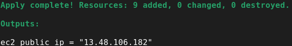
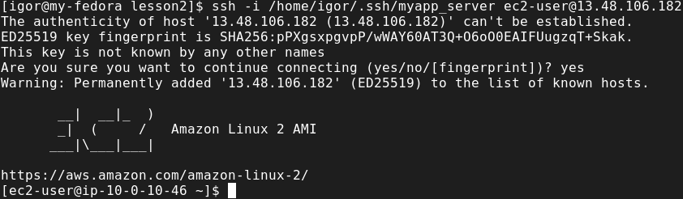
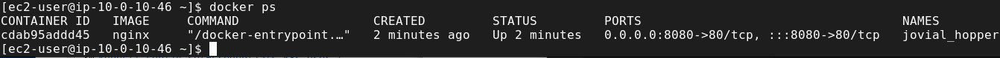
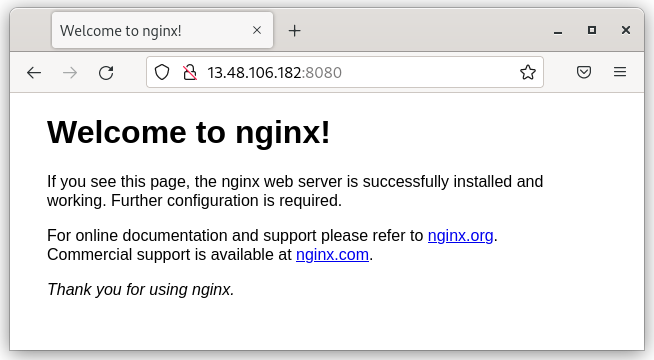
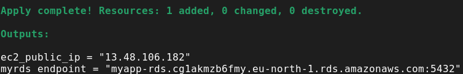
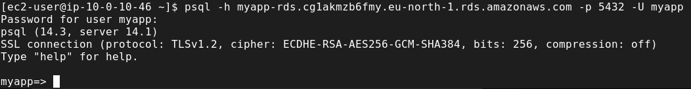

## Написать terraform манифест для разворачивания AWS EC2. Этот инстанс должен содержать nginx. Nginx должен быть установлен во время провиженинга инстанса, например с помощью user data.

Всё манипуляции произвожу на своём личном аккаунте AWS. 
Terraform создаст VPC, Subnets, Security Group, EC2 instance, Key pair для SSH и запустит nginx в Docker на этом instance. И вывести в output публичный ip адрес.
Выполняю
```bash
terraform apply --auto-approve
```



Проверяю, что можно подключиться по SSH



Проверяю, что nginx запущен в Docker



На него можно попасть по публичному IP инстанса



## (Дополнительно) Добавить в манифест код для создания базы данных AWS RDS. Тип базы на ваше усмотрение. 

Добавил файл rds.tf и outputs теперь покажет endpoint базы данных.



База данных находится в приватной подсети поэтому попасть в неё из вне не получится.
Захожу на EC2 инстанс и проверяю, что к базе есть подключение

